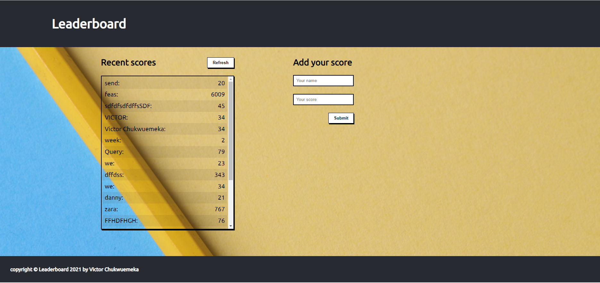

# Leaderboard

The leaderboard website displays scores submitted by different players. It also allows you to submit your score. All data is preserved thanks to an [external API](https://www.notion.so/Leaderboard-API-service-24c0c3c116974ac49488d4eb0267ade3).

  

## Built With

- HTML
- CSS
- JAVASCRIPT (ES6)
- WEBPACK

## Live Demo

[Live Demo Link](https://chukwuemeka1234.github.io/Leaderboard/dist/index.html)

## Getting Started

To get a local copy up and running follow these simple steps.

### Prerequisites

some knowledge on `npm` webpack and ES6

### Setup

- Clone repository
- run `npm start`
### Install

- Node modules
- HtmlWebpackPlugin `npm install --save-dev html-webpack-plugin`
- Load CSS `npm install --save-dev style-loader css-loader`
- Setup local dev server `npm install --save-dev webpack-dev-server`

## Authors

👤 **Author**

- GitHub: [@chukwuemeka1234](https://github.com/chukwuemeka1234)
- Twitter: [@avc_victor](https://twitter.com/@avc_victor)
- LinkedIn: [ani-chukwuemeka](https://linkedin.com/in/ani-chukwuemeka-a65421199/)

## 🤝 Contributing

Contributions, issues, and feature requests are welcome!

## Show your support

Give a ⭐️ if you like this project!

## 📝 License

This project is [MIT](./MIT.md) licensed.